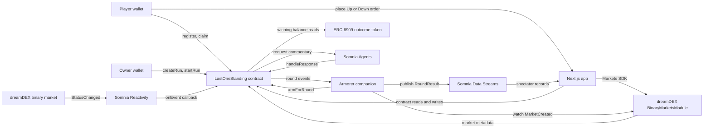
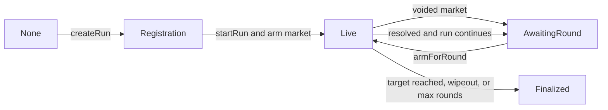

# Last One Standing architecture

This document describes the current implementation of Last One Standing. It is the
canonical technical overview; the repository's
[build plan](../last-one-standing-plan.md) is retained as historical design context
and may describe approaches that were not implemented.

Last One Standing is a scheduled elimination bracket built on dreamDEX binary Event
Contracts. Players escrow an entry stake, take a real Up or Down position in each
round, and survive only when their winning outcome-token balance meets the configured
minimum. Somnia Reactivity invokes the game contract when a market resolves or is
voided.

The code is educational reference software and has not been audited. See the
[legal disclaimer](../DISCLAIMER.md).

## Goals and non-goals

The system is designed to:

- settle eliminations on-chain from dreamDEX market state;
- avoid a privileged keeper for deciding winners;
- keep runs bounded in duration and player count;
- use pull-based, equal-split prize claims;
- expose a separate spectator feed without making it authoritative; and
- demonstrate Somnia Reactivity, Data Streams, and Agents in one application.

It is not designed to:

- custody or place outcome-token orders on a player's behalf;
- support more than 32 players in one run;
- guarantee that a successor market is always available;
- make the companion or Data Streams feed authoritative for settlement; or
- provide an audited, production-ready trading system.

## System context

Settlement authority remains on-chain. The companion chooses and arms successor
markets, but it does not decide who survives. Data Streams and generated commentary
are presentation layers.

## Repository layout

- [`src/LastOneStanding.sol`](../src/LastOneStanding.sol) contains escrow, run state,
  per-market Reactivity subscriptions, elimination, finalization, claims, and Agents
  callbacks.
- [`src/interfaces/`](../src/interfaces/) contains the minimal dreamDEX and Agents
  interfaces used by the contract.
- [`companion/index.ts`](../companion/index.ts) discovers successor markets, submits
  `armForRound`, and publishes round records.
- [`app/`](../app/) and [`components/`](../components/) contain the Next.js routes and
  wallet, player, owner, spectator, and demo interfaces.
- [`lib/`](../lib/) contains shared ABI, chain, client, schema, and demo definitions.
- [`scripts/register-schemas.ts`](../scripts/register-schemas.ts) registers the Data
  Streams data and event schemas.
- [`script/Deploy.s.sol`](../script/Deploy.s.sol) deploys the contract on Shannon.
- [`test/LastOneStanding.t.sol`](../test/LastOneStanding.t.sol) tests the contract with
  local market and token mocks.

## Roles and trust boundaries

### Owner

The deployer begins as `owner`. Only the owner can create runs, set the armorer, and
transfer ownership. The owner is also an operator and can start or arm rounds.

### Armorer and companion

The `armorer` is an operator allowed to call `startRun` and `armForRound`. In normal
operation, the companion wallet fills this role.

The contract verifies that an armed market is Trading, uses the configured collateral,
and has the run's `venueId`. It does not verify `seriesAsset` or `intervalSec` on-chain,
so the operator is trusted to select a market from the intended series. The companion
performs those asset, interval, and venue checks before submitting a transaction.

### Players

Players approve and escrow the configured ERC-20 `entryStake`, place their own
dreamDEX orders, and claim prizes if they become claimants. They cannot alter run
configuration or settlement results.

### External Somnia services

- The Reactivity precompile is the authorized path to `onEvent`; the contract maps the
  event emitter back to the active run.
- dreamDEX market status and payout numerators determine whether a round is void and
  which outcome won.
- ERC-6909 balances determine survival.
- Somnia Agents commentary is optional and cannot alter game state.
- Data Streams records are spectator data and cannot alter settlement or claims.

## Core data model

Each `Run` stores:

- series identity: `seriesAsset`, `intervalSec`, and `venueId`;
- limits: `targetSurvivors`, `maxRounds`, and `maxPlayers`;
- economics: `entryStake`, `minPosition`, `prizePool`, and `unclaimedPrize`;
- progress: round, survivor, claimant, and claim counters;
- active market data: `trackedMarketId`, market address, Yes and No token IDs, and
  Reactivity subscription ID; and
- the current `RunStatus`.

Supporting mappings track registration, elimination round, claimant and claimed flags,
terminal-event idempotency, active market emitters, commentary requests, and final
commentary. The contract also stores the full player list, current survivors, and a
snapshot of survivors at the beginning of the active round.

Never identify a round by a dreamDEX pool address. Pool addresses can be recycled;
`marketId` is the durable round identifier.

## Run state machine

`startRun` first changes a run from Registration to AwaitingRound and then arms the
first market in the same transaction. A successful arm leaves the run Live.

## End-to-end live flow

1. The owner calls `createRun` with a series, venue, limits, entry stake, and minimum
   outcome-token position.
2. Players approve the collateral token and call `register`. The contract transfers
   each entry stake into escrow and adds it to the prize pool.
3. The owner or armorer calls `startRun` with a live Trading market.
4. `_armForRound` resolves the market through `BinaryMarketsModule.markets`, validates
   its collateral and venue, snapshots current survivors, and subscribes to that
   market's `StatusChanged(uint8,uint8)` event.
5. Players place Up or Down orders directly through dreamDEX. The game contract does
   not place orders and does not custody outcome tokens.
6. When the market reaches Resolved or Voided, Somnia Reactivity invokes the contract.
   `_onEvent` validates the emitter and delegates terminal processing to
   `_handleTerminal`.
7. A void returns the run to AwaitingRound without incrementing `roundCount`. A
   resolution checks each survivor's winning-token balance and emits settlement and
   elimination events.
8. If the run continues, the companion discovers a matching Trading successor and
   calls `armForRound`. Otherwise, the contract finalizes the winner set.
9. Final claimants call `claim` to withdraw an equal share of the escrowed prize pool.
   The last claimant receives any integer-division remainder.

## Round settlement rules

### Resolved markets

The contract reads `payoutNumerators()` from the tracked market. Index 0 represents Up
(Yes), and index 1 represents Down (No). The greater numerator selects the winning
side; equal values select Up under the current comparison.

For every current survivor:

- a winning ERC-6909 balance greater than or equal to `minPosition` survives; and
- a lower, absent, or losing balance is eliminated.

Balances are checked when the terminal event is handled, not when the market locks.

### Voided markets

A void is a push. No player is eliminated, `roundCount` is unchanged, and the run
returns to AwaitingRound so another market can be armed.

### Finalization

The contract finalizes when:

- survivors are at or below `targetSurvivors`;
- `maxRounds` has been reached; or
- a resolved round eliminates every survivor.

For a full wipeout, the claimant set is the snapshot taken at that round's start.
Otherwise, the remaining survivors are claimants.

### Idempotency and bounds

`roundHandled[runId][marketId]` ensures that a terminal market is processed once.
`runByMarket` prevents two live runs from tracking the same market address at the same
time.

Elimination is a bounded on-chain loop. `HARD_MAX_PLAYERS` limits a run to 32 players,
and each Reactivity subscription requests a 12,000,000 gas handler limit.

## Reactivity subscription lifecycle

The contract subscribes to the active market address with topic 0 set to
`keccak256("StatusChanged(uint8,uint8)")`. The handler ignores non-terminal
transitions. On the next arm, the previous subscription is removed before a new one is
created.

Production deployments enable subscriptions. Tests disable them and expose
`_handleTerminal` through a harness, allowing deterministic settlement tests without
the precompile.

The contract must retain native STT to pay for callbacks. Deployment funds it with
33 STT: 32 STT protects the Reactivity subscription-owner balance floor, while the
remaining balance can fund callbacks and optional Agents requests.

## Companion service

[`companion/index.ts`](../companion/index.ts) is an off-chain process with three jobs:

1. Watch `RoundSettled` and `RoundVoided`, publish a `RoundResult`, and scan for a
   matching successor.
2. Subscribe broadly to `MarketCreated` on the BinaryMarketsModule, decode matching
   events, and call `armForRound` for AwaitingRound runs.
3. Watch `CommentaryReady` and republish the pending round record with commentary.

Successor discovery checks that the market is active and binary, matches
`seriesAsset`, `intervalSec`, and `venueId`, differs from the previous `marketId`, and
is Trading on-chain.

The companion is required for automatic progression between rounds. If it is offline
or no matching successor exists, the run remains safely in AwaitingRound. An owner or
armorer can still arm a valid market manually.

## Data Streams spectator layer

[`lib/schema.ts`](../lib/schema.ts) defines `RoundResult` with:

- timestamp, run ID, and round number;
- market ID, winning side, and void flag;
- eliminated and surviving player counts; and
- optional commentary.

The deterministic record ID hashes `(runId, marketId)`. Publishing commentary for an
existing round therefore updates the same logical record. The stream is useful for
spectator history, but contract state and events remain authoritative.

## Agents commentary

After a resolved round, the contract may request one short sports-broadcast sentence
from Somnia Agents. It skips the request if Agents are disabled, the request deposit
cannot be read, or the contract lacks the Reactivity floor plus the required deposit
and reward.

`handleResponse` accepts calls only from the configured Agents contract. It stores and
emits a response only when matching successful responses satisfy the request threshold.
Failure affects commentary only.

## Frontend architecture

The Next.js application uses Wagmi and Viem for wallet and contract access, the
dreamDEX Markets SDK for order placement and market discovery, and the Data Streams
SDK for the spectator feed.

- `/` and `/runs` list on-chain runs.
- `/run/[id]` reads run/player state and exposes registration, faucet, order, and claim
  actions. It also displays streamed round history.
- `/owner` discovers market series and calls owner-only `createRun`.
- `/demo` runs a deterministic local simulation from `lib/demo-data.ts`. It does not
  use a wallet, RPC, transaction, or Data Streams record.

The live run view polls contract state, while the round feed separately polls Data
Streams. UI state is never used as settlement input.

The first `startRun` operation is not exposed in the current UI. An owner or armorer
must perform it through a script or direct contract call. The companion handles
subsequent `armForRound` calls.

## Configuration and deployment

The target network is Somnia Shannon, chain ID 50312. Network addresses are centralized
in [`lib/config.ts`](../lib/config.ts); the deployed game address and registered schema
IDs are environment-specific.

Server-only secrets and configuration include:

- `PRIVATE_KEY`, `RPC_URL`, and `ARMORER_ADDRESS` for Foundry deployment;
- `ARMORER_PRIVATE_KEY` for companion transactions;
- `GAME_ADDRESS` and `ROUND_RESULT_SCHEMA_ID` for the companion; and
- `INDEXER_URL` when overriding the default dreamDEX indexer.

Browser-visible configuration uses the corresponding `NEXT_PUBLIC_GAME_ADDRESS`,
`NEXT_PUBLIC_ROUND_RESULT_SCHEMA_ID`, `NEXT_PUBLIC_PUBLISHER_ADDRESS`, and
`NEXT_PUBLIC_INDEXER_URL` values. Private keys must never use the `NEXT_PUBLIC_`
prefix.

The current Shannon integrations are:

- BinaryMarketsModule: `0x3ecC694Cef705358864a646142ac17A90E29e388`
- OutcomeToken6909: `0xB52c5934113Af5c0Bb20eb3C72290C8215f755b9`
- tUSDC collateral: `0x70a86D8842FB63C4Ad2b7cdddF530eBf1BB25d8E`
- Agents platform: `0x037Bb9C718F3f7fe5eCBDB0b600D607b52706776`

See the [README](../README.md) for the deployment and startup runbook.

## Failure modes and operational constraints

- No matching Trading successor leaves a run in AwaitingRound; it does not corrupt or
  finalize the run.
- The companion's broad `MarketCreated` subscription may receive unrelated events;
  decoding and series checks filter them before arming.
- Indexer lag can delay market discovery even when a market exists on-chain.
- Player orders can fail because of expiry, liquidity, allowance, network, or wallet
  conditions. Only the final winning-token balance matters to the contract.
- An underfunded game contract can lose Reactivity liveness or skip commentary.
- An incorrectly chosen market can preserve venue and collateral while mismatching the
  intended asset or interval; operator key security and companion checks are therefore
  important.
- Data Streams or Agents outages degrade spectator features but do not change
  settlement or claims.

## Testing

Foundry tests use mock ERC-20, ERC-6909, binary module, and market contracts. Coverage
includes:

- correct, wrong, absent, and undersized positions;
- voided rounds;
- full-wipeout claimant selection;
- target-survivor and max-round finalization;
- equal-split claims and duplicate-claim prevention;
- venue validation; and
- idempotent terminal handling.

Run `forge test` for contracts and `npm run typecheck` for the TypeScript application
and companion.

## Documentation ownership

- Update this document when contract state, settlement, trust boundaries, or companion
  behavior changes.
- Update the [README](../README.md) when setup or operator steps change.
- Keep the [build plan](../last-one-standing-plan.md) as historical rationale rather
  than treating it as the implemented specification.
